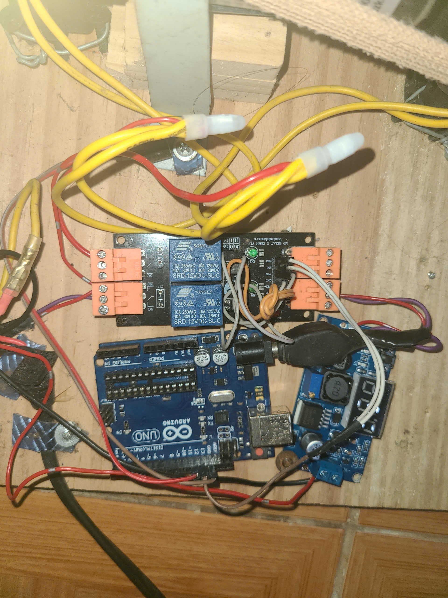
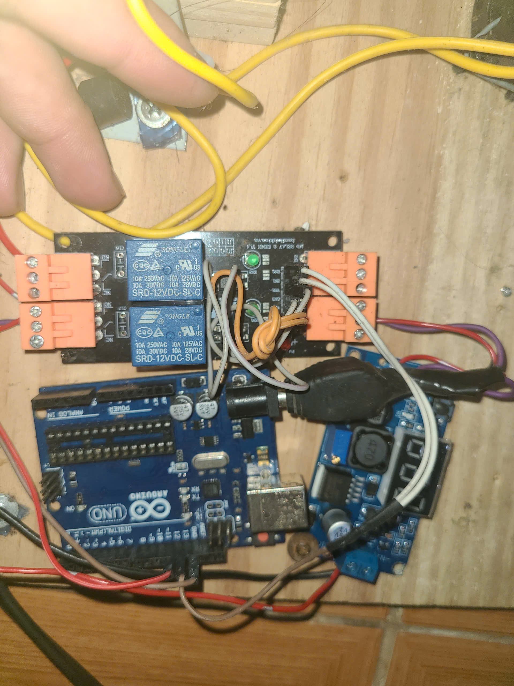
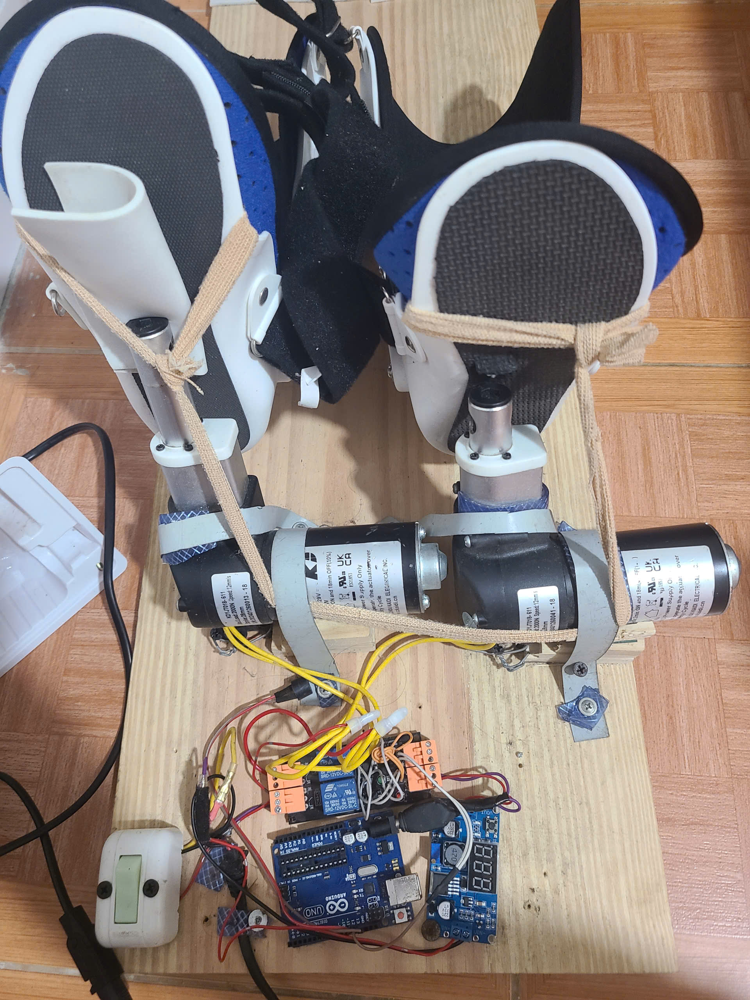
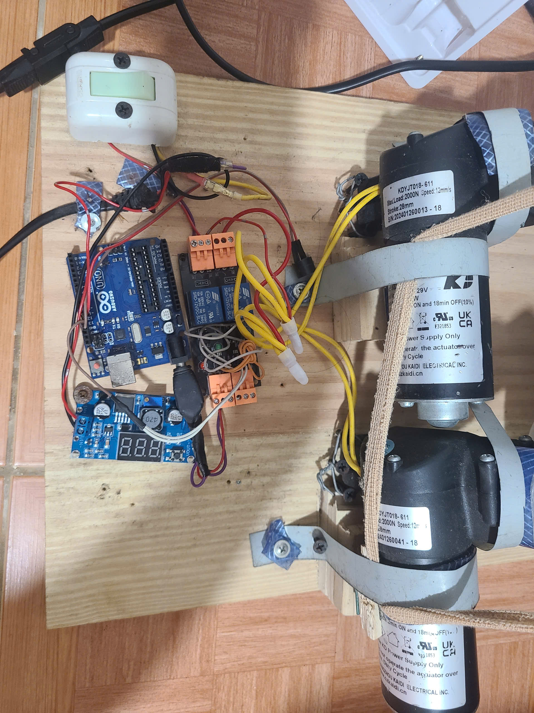

MÁY TẬP CỔ CHÂN DÙNG ADRUINO UNO VÀ MODULE RELAY 2 KÊNH, HẠ ÁP 24V-5V , 2 XILANH ĐIỆN 24V  HÀNH TRÌNH 30MM
đấu chân gpio 13 (led blink) vào chân EN1 En2 (đấu cùng vào) 
chân 11 nút nhấn
12 còi buzz
các dây xilanh điện nối như ảnh. cứ 1 cái gập cổ chân vào 1. cái ra nhịp nhàng theo led nháy
# Arduino UNO - Điều Khiển LED và Buzzer qua Nút Nhấn

Chương trình điều khiển Arduino UNO với 2 chế độ hoạt động, bật/tắt bằng nút nhấn.

## 📋 Yêu Cầu Phần Cứng

- Arduino UNO x1
- Nút nhấn x1
- Buzzer (còi) x1
- LED x1 (tuỳ chọn - Arduino UNO đã có LED tích hợp trên chân 13)
- Điện trở 220Ω hoặc 330Ω (cho LED, tuỳ chọn)
- Dây jumper
- Cáp USB Type B

## 🔌 Sơ Đồ Kết Nối

### Nút Nhấn (chân 11)
```
Arduino Pin 11 ----[Button]---- GND
(Pull-up resist được bật trong code)
```

### Buzzer (chân 12)
```
Arduino Pin 12 ---- Buzzer(+)
GND --------------- Buzzer(-)
```

### LED (chân 13)
```
Arduino Pin 13 ----[LED]---- 220Ω Resistor ---- GND
                  (Dài)
```

**Hoặc dùng LED tích hợp trên Arduino UNO** (không cần kết nối thêm):
- Arduino UNO có LED sẵn trên chân 13 (màu vàng/xanh lá)

## 📸 Hình Ảnh

### Hình 1: Sơ đồ lắp ráp


### Hình 2: Chi tiết kết nối


### Hình 3: Bố cục lắp ráp


### Hình 4: Hoàn thiện


## 🎮 Chức Năng

### 1. Ấn Nút 1 Lần
- **Buzzer kêu:** 1 tiếng dài 1 giây (tút)
- **Chạy:** Chương trình 1
  - LED nhấp nháy: 5 giây sáng → 5 giây tắt (lặp lại)
  - Sau 30 phút: Buzzer kêu 6 tiếng (0.5s kêu, 0.5s tắt) rồi dừng

### 2. Ấn Nút 2 Lần Liên Tiếp (trong 500ms)
- **Buzzer kêu:** 2 tiếng (tút-tút)
- **Chạy:** Chương trình 2
  - LED nhấp nháy: 25 giây sáng → 25 giây tắt (lặp lại)
  - Sau 30 phút: Buzzer kêu 6 tiếng rồi dừng tất cả

### 3. Ấn Giữ Nút (> 2 giây)
- **Buzzer kêu:** 3 tiếng ngắn (tút-tút-tút)
- **Kết quả:** Dừng tất cả chương trình

## 💾 Cài Đặt và Nạp Code

### Cách 1: Dùng Arduino IDE (Đơn Giản)
1. Mở **Arduino IDE**
2. **File** → **Open** → Chọn `maytapcochan.ino`
3. **Tools** → **Board** → Chọn **Arduino Uno**
4. **Tools** → **Port** → Chọn port của Arduino (VD: `/dev/cu.usbserial-xxx`)
5. Nhấn **Upload** (mũi tên phải) hoặc **Ctrl+U**
6. Chờ đến khi thấy "Done uploading"

### Cách 2: Dùng Arduino CLI (Terminal)
```bash
cd /path/to/maytapcochan
arduino-cli compile -b arduino:avr:uno maytapcochan.ino
arduino-cli upload -p /dev/cu.usbmodem14101 -b arduino:avr:uno maytapcochan.ino
```
*Thay `/dev/cu.usbmodem14101` bằng port thực tế của bạn*

**Tìm port:**
```bash
arduino-cli board list
```

## 📝 Cài Đặt Arduino CLI (macOS)
```bash
# Cài đặt
brew install arduino-cli

# Cài core cho Arduino AVR
arduino-cli core install arduino:avr
```

## 🔧 Cấu Hình Port

### macOS
- Thường là: `/dev/cu.usbmodem14101` hoặc `/dev/cu.usbserial-xxx`
- Kiểm tra: `arduino-cli board list`

### Linux
- Thường là: `/dev/ttyUSB0` hoặc `/dev/ttyACM0`

### Windows
- Thường là: `COM3`, `COM4`, etc.

## 📊 Thông Tin Bộ Nhớ

- **Program Storage:** 2112 bytes / 32256 bytes (6%)
- **Dynamic Memory:** 43 bytes / 2048 bytes

## 🐛 Khắc Phục Sự Cố

### Arduino không được phát hiện
- Kiểm tra dây USB đã cắm chắc
- Cài driver CH340 hoặc FTDI nếu cần
- Thử port khác trong Tools → Port

### Buzzer không kêu
- Kiểm tra cực dương/âm buzzer có cắm đúng không
- Dùng đồng hồ vạn năng kiểm tra buzzer

### LED không sáng
- LED dài kết nối với chân 13, LED ngắn kết nối GND
- Nếu dùng LED ngoài, kiểm tra điện trở và cực

## 📖 Tham Khảo
- [Arduino Official Documentation](https://www.arduino.cc/en/Guide)
- [Arduino UNO Pinout](https://store.arduino.cc/products/arduino-uno-rev3)

---
**Phiên bản:** 1.0  
**Ngày tạo:** 6 tháng 4, 2026  
**Tác giả:** Arduino Enthusiast
